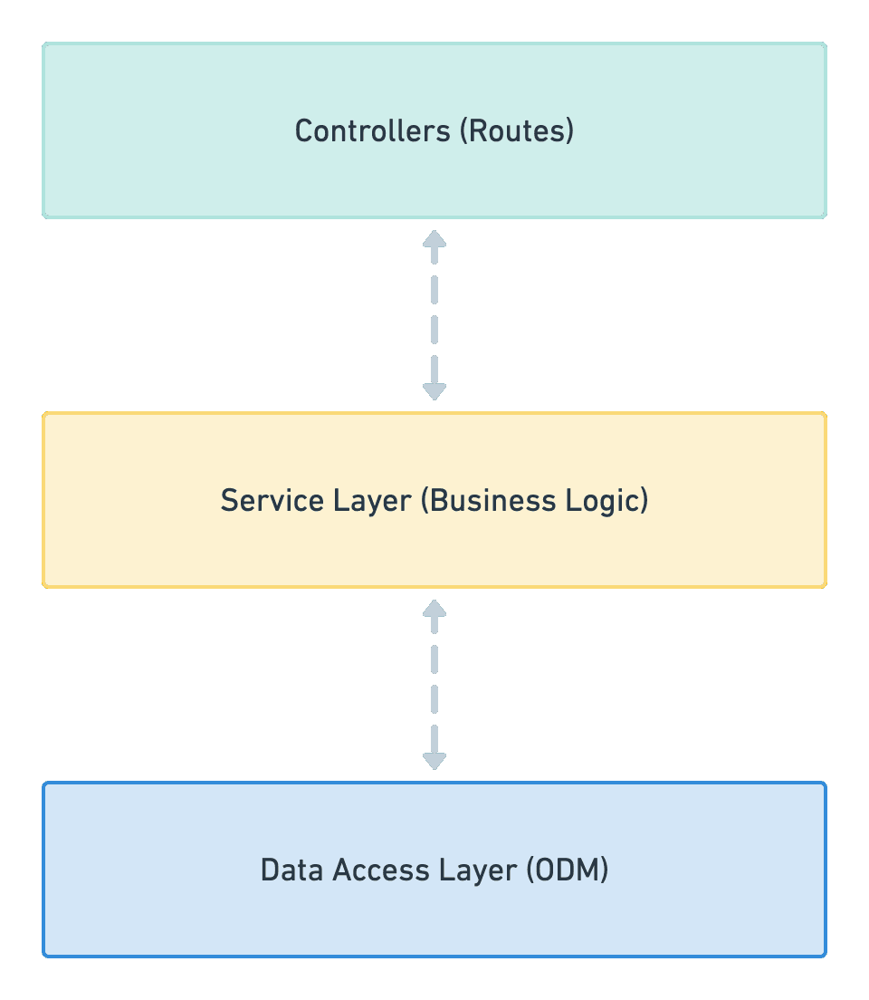
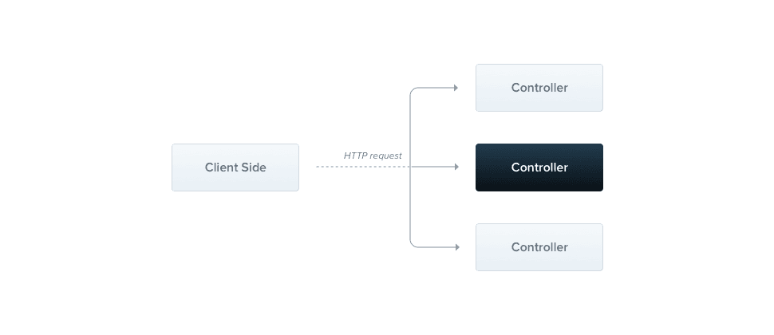

<p align="center">
    
</p>

# What is NestJS?

- NestJS is a powerful framework for building server-side applications with Node.js
- NestJS is a progressive Node.js framework built with TypeScript and inspired by the architecture of Angular
- NestJS is an MVC framework for building efficient, scalable Node.js server-side applications
- It provides a solid structure for developing scalable and modular server-side applications
- With its module-based approach, NestJS facilitates code reusability and dependency management
- NestJS has proven to be the fastest-growing TypeScript framework for building flexible, scalable, large-scale, and enterprise-ready backend applications using Node.js
- When building highly testable, well-structured, and maintainable backend applications using TypeScript, NestJS is the top choice for top organizations
- Inspired by Angular.js, it uses Express.js under the hood.
- It follows three programming paradigm techniques.

  - Object Oriented Programming (organizes software design around data and objects rather than functions and logic)
  - Functional programming (constructed by applying and composing functions)
  - Functional Reactive programming (Asynchronous Dataflow Programming)

- NestJS framework provides the following common services, and developers focus on business code to build quickly and easily.

  - Authentication and Authorization
  - Routing
  - Request body parse
  - Response
  - Error handler
  - logger
  - middleware

- This framework inspired by the Angular framework that uses Typescript and hierarchical components.

# When to use NestJS?

- NestJS is an excellent choice for building a back-end system for businesses that need to manage large amounts of sensitive data, transactions, and security protocols – as well as handle a massive volume of requests and support millions of users’ interactions.

- For example, e-commerce platforms, banking and financial institutions, streaming services, gaming companies, transportation and logistics companies, and social media platforms are among the many businesses that can benefit from NestJS’s robust features and modular architecture.

# NestJS Benefits

NestJS is a top-tier framework if you’re looking to streamline your development process and maximize productivity. Its modular architecture and powerful features enable you to create reusable and maintainable code, increasing efficiency and cutting down on development time. Ultimately, NestJS lets you focus on higher-level tasks while building complex applications quickly and efficiently. One of NestJS’s standout features is its built-in security measures. By offering authentication, validation, and encryption out of the box, you can make sure your applications are secure without investing extra time or resources. Moreover, NestJS’s built-in testing utilities make it easy to write and execute tests, improving the overall quality and reliability of code.

# Features/Advantages

- Typescript support.
- Open-source (MIT license).
- Easily Integrate with ORMS such as Prism, TypeORM, and Graphql
- Nest CLI (Almost every other framework is providing a CLI) to initialize and develop your applications.
- Excellent Documentation.
- Easy unit testing just like Angular.
- Highly scalable.
- Built for large scale enterprise applications ( nx.dev uses Nest Js).
- Architecture
  - Easy to learn and build applications
  - Typed language based on Typescript
  - Provides Command Line Interface(CLI) to create and build Production applications quickly
  - Folder structure and Architecture is similar to Angular
  - Inbuild support annotations for clean code
  - Modular Design
  - Microservice Architecture
- Performance
  - Frameworks improve productivity
  - Highly scalable in terms of horizontal scaling
- Testing
  - Easily test individual components for developer
  - Automates the testing to improve productivity

# Understanding Nest.JS Project Structure

<p align="center">
    
</p>

- `node_modules` - Contains all the libraries that are required for your project.
- `src` - Contains your application source code, Under this directory Nest.JS has generated a starter code. Let's explore what they are,

  - `app.controller.spec.ts` - Contains unit test cases for each controller implementation
  - `app.controller.ts` - Contains the implementation of the API
  - `app.service.ts ` - Contains business logic which will be used in the controller
  - `app.module.ts` - Contains Imports, Exports and DI(Dependency Injection)
  - `main.ts` - Contains implementation to bootstrap the application. This is the starting point of your application

- `test` - Contains E2E test case implementations
- `.eslintrc.js` - Contains lint configuration that helps to identify incorrect syntax, typescript standards and more ...
- `.gitignore` - Contains files & directories to ignore when pushing the code to GitHub
- `.prettierrc` - Contains prettier config to format your code
- `nest-cli.json` - Basic Nest.JS Configuration
- `package.json` - Contains dependency, scripts, project version and more required for your project
- `README.md` - Contains documentation of your project
- `tsconfig.json` - Contains typescript configurations

# Nest.js Architecture

Nest.js uses a 3-tier architecture that separates codes into 3 main components and enables developers to create fewer spaghetti codes:

- Controllers
- Services
- Data Access layer

<p align="center">
    
</p>

Nest.js 3rd-tier layer architecture

## Controllers

They serve as a middleman between client requests and responses. It is responsible for handling the incoming requests and returning responses to the client through HTTP protocol.

<p align="center">
    
</p>

Overview of Nest.js controllers

The controller receives a specific request for the application through the routing mechanism created and processes the request.

Nest.js uses classes and decorators to create controllers and map each class method to routes to receive a specific request.

Here is an example of a controller using decorators:

```ts import { Controller, Get } from '@nestjs/common';
@Controller("todos")
export class TodosController {
  @Get()
  findAll(): string {
    return "This action returns all todos";
  }
}
```

The `@Controllers`, and `@Get` are the decorators used to inform Nest.js that we are creating a `Todos` controller and the `findAll` method is a `GET` request.

## Services

Services are part of Nest.js Providers. Providers are the fundamental of Nest.js, with the main idea of injecting it as a dependency.

With dependency injection, relationships among various components, controllers, and other application parts are created.

Specifically, services are part of the code block that includes only the business logic.

For example, implementing all the database CRUD operations and methods to determine how data can be created, stored, and updated.

Here is an example of Services used to manage an array of Todos:

```ts
import { Injectable } from "@nestjs/common";
import { Todo } from "./interfaces/todo.interface";

@Injectable()
export class CatsService {
  private readonly todos: Todo[] = [];

  create(todo: Todo) {
    this.todos.push(todo);
  }

  findAll(): Todo[] {
    return this.todos;
  }
}
```

The service class uses the `Injectable()` decorator showing that it is a provider and it can be injected as a dependency into any other class. e.g., controllers.

Next, we created a todos array that will contain all our todos that will be created using the `create` method and retrieved using the `findAll` method.

## Data Access Layer

The data access layer takes care of and provides logic to access data stored in persistent storage of some kind.

It is located on the lowest level, dealing with the database and encapsulating data access details, and providing a friendly access interface for the upper layer.

Here is an example of an Entity-centric definition type:

```ts
interface Todo {
  title: string;
  description: string;
  isDone: boolean;
}
```

The code above shows a basic type definition for our Todo data. Now this interface can be customized to represent the different database schemas and columns that our application will use.
